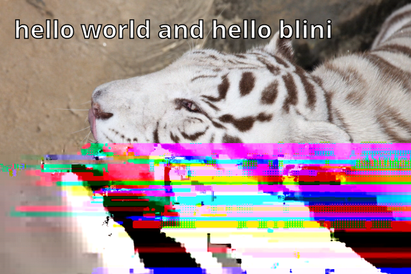

# Blini

Chatbot module based on second-order Markov chains.

## Features
* Text generation with two words of context (or fewer if the learned vocabulary is too small)
* Japanese tokenization using [TinySegmenter](http://chasen.org/~taku/software/TinySegmenter/), including mixed Japanese/alphabetical strings
* Index of image URLs (e.g. for overlaying text output on top of learned images)
* Tagging support for tokens (e.g. for generating output based on metadata gathered during learning)
* Optional persistent storage via [node-persist](https://github.com/simonlast/node-persist#readme), or any similar package that provides a `setItem()` function based on the [Web Storage API](https://developer.mozilla.org/en-US/docs/Web/API/Web_Storage_API)

## Usage
### Basic text generation
```javascript
const blini = new (require('blini')).Blini();
blini.processInput('hello world and hello blini');
console.log(blini.generateOutput('')); // Generates output without context
console.log(blini.generateOutput('hello')); // Generates output with a single word of context
console.log(blini.generateOutput('hello world')); // Generates output with two words of context
console.log(blini.generateOutput('goodbye world')); // Generates output with only the last word for context, because "goodbye" is not part of the learned vocabulary
console.log(blini.generateOutput('goodbye and hello')); // Generates output with context taken from the last two words of the input
```

Example output:

```sh
hello world and hello blini
hello blini
hello world and hello blini
goodbye world and hello blini
goodbye and hello blini
```
Of course, the more natural text is provided for learning, the more varied and interesting the output will be.

### Setting up persistent storage using `node-persist`
```javascript
const blini = new (require('blini')).Blini();
const storage = require('node-persist');

storage.init().then(_ => {
    blini.storage = storage;
    storage.getItem('bliniDictionary').then(function(data) {
        if (data) blini.dictionary = JSON.parse(data);
        console.info(`Loaded Blini dictionary (${Object.keys(blini.dictionary).length} entries)!`);
    });
    storage.getItem('bliniImages').then(function(data) {
        if (data) blini.images = JSON.parse(data);
        console.info(`Loaded Blini images (${Object.keys(blini.images).length} entries)!`);
    });
});
```

### Image generation
There are some special requirements to enable image generation.
* It needs filesystem write access to the `img/.attachments` path (relative to your application's working directory), to store generated images temporarily and delete them after your callback function has completed.
* It needs its `imageFonts` property set to a list of fonts to use for overlaying text on top of images. You can specify multiple fonts to cover a larger range of character sets, for example latin characters, Chinese characters, emoji, etc.
    * Fonts must be objects with `path` and `family` properties. You can use relative paths, based on your application's working directory, and copy the fonts you need manually for portability.

And some restrictions:
* Images must have an aspect ratio no higher than 2.5 in either direction.
* Some hosts may reject image requests (if a 403 error is reported in the console, that is likely the problem).
```javascript
const blini = new (require('blini')).Blini();
blini.imageFonts.push({ path: '.fonts/NotoSans-Bold.ttf', family: 'Noto Sans' });

blini.processInput('hello world and hello blini');
blini.processImage({ width: 985, height: 656, url: 'https://media.xiph.org/tdaede/a.png' });
blini.generateImage('hello world', async function(imagePath) {
    if (!imagePath) {
        throw new Error('could not generate an image');
    }

    // Copy the generated image, as the temporary file will be deleted after this function returns.
    fs.copyFile(imagePath, 'out.png', err => {
        if (err) {
            console.log(err);
        } else {
            console.log('Generated an image at out.png!');
        }
    });
    return new Promise(null);
});
```
Example output:


